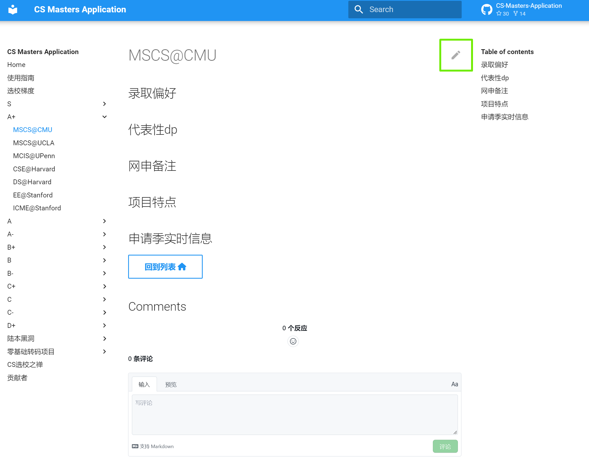
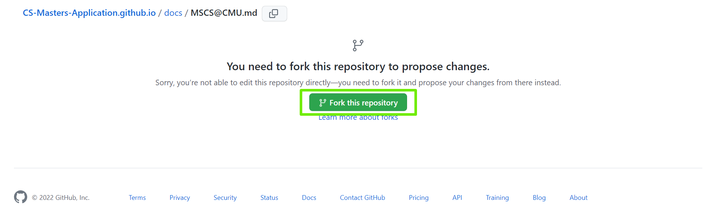
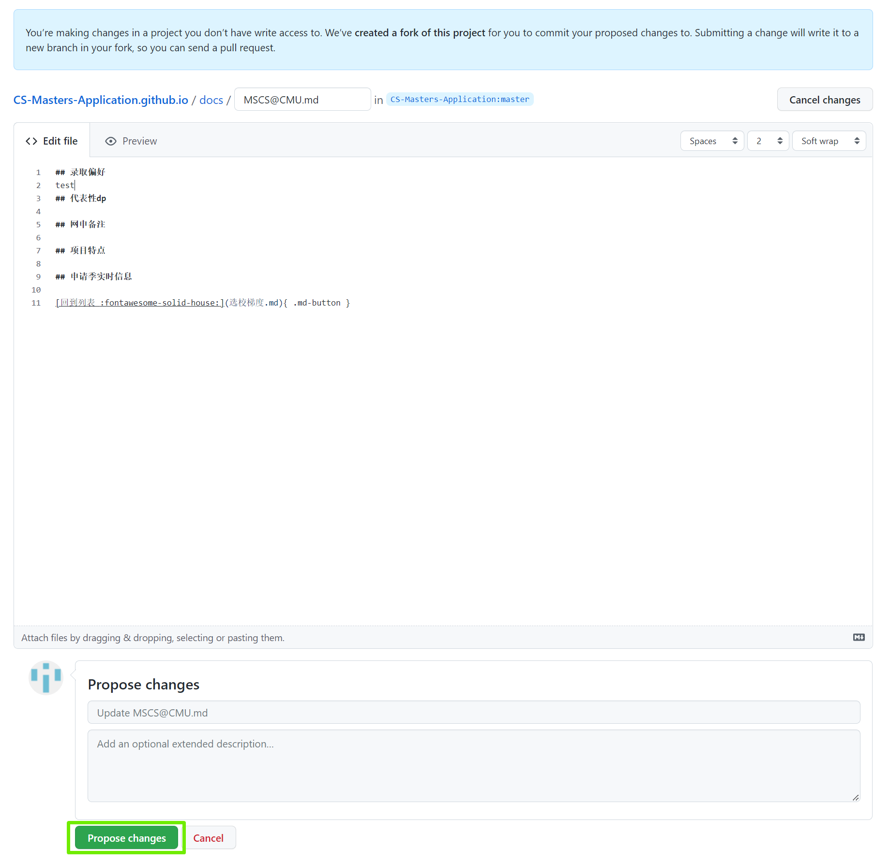
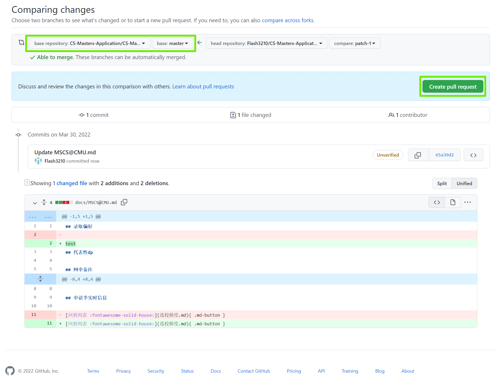
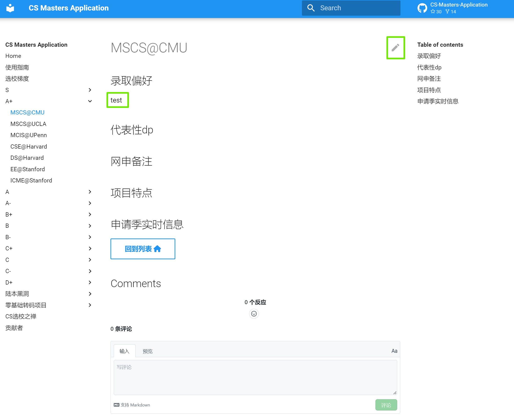

## Application Book的创作初衷

1. 快速建立对项目申请难度的认知，轻松地根据背景进行项目初选
2. 快速了解有哪些同档项目可以选择，避免遗漏项目
3. 了解项目特点和录取特点，根据背景扬长避短，合理选校

## 创作声明

1. 选校梯度以及项目详情页的内容会非常主观，可能与客观现实存在偏差
2. 选校难度梯度是针对陆本而言的，产生方法是22fall申请季大家对项目难度的群体认知
3. 很多项目因为样本过少(尤其C+以下的项目)，选校梯度很可能并不准确
4. 申请人不应完全依赖本文档信息，应当参考文档信息自主决策

## 建议使用方法

### 初识申请

建议申请者通过[一亩三分地定位选校版](https://www.1point3acres.com/bbs/forum-79-1.html)和[一亩三分地offer多多](https://offer.1point3acres.com/)定位自己的背景的彩票/冲刺/主申/保底校应该落在哪一档。结合本文档建立项目申请难度认知，根据本文档快速完成初选。

### 选校

点击列表中各个项目进入详情页，查看可能的录取偏好和项目特点。根据自己软硬背景，读研目的，未来规划（留美找工/回国就业/移民海外）综合进行考虑，选择对于自己最match的项目。

### 补申

如遇补申阶段，可以快速在自己保底档及下面更低的档位进行再一轮选校。

## 如何贡献

本文档是开源协同创作的，欢迎用户贡献内容

### Pull Request（推荐）

PR (Pull Request)是基于Git的协同创作方式，允许用户方便地进行贡献内容，允许维护者进行审核。

下面演示通过GitHub网站进行无代码PR的最佳实践

1. 点击想要更改的页面右上角的编辑图标（铅笔形状）

	

2. 初次提交点击`Fork this repository`将仓库fork到自己的账户下

	

3. 在窗口内使用Markdown语法直接进行更改，点击`Propose changes`完成更改

	

4. 点击`Create pull request`向`CS-Masters-Application.github.io:master`分支发起Pull Request

	

5. 点击`Create pull request`确认创建Pull Request

	

6. 等待Pull Request审核通过后，内容会被自动编译并部署到网页，不需要用户进行额外操作。再次提交更新重复步骤1即可，第二次提交可以省略步骤2

	

### 通过[QQ群](https://jq.qq.com/?_wv=1027&k=Ikr0DObs)手动更新

1. 点击想要更改的页面右上角的编辑图标（铅笔形状）

2. 复制文档内容到本地进行更改

3. 群中@群主和管理员提供你更改后的文档

### 评论区

欢迎在评论区讨论，维护者会精选信息编入pages
